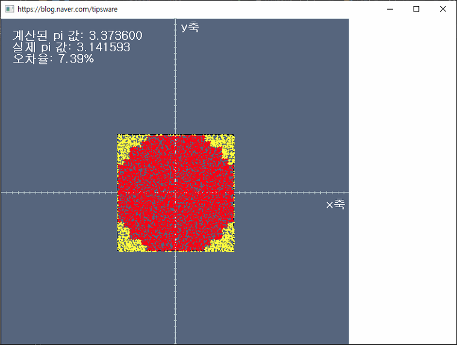

# 1주차- Monte carlo simulation

---

## 실습 전 준비사항
### Visual Studio 설치
1. https://visualstudio.microsoft.com/ko/downloads/
2. 커뮤니티 버전 다운로드
3. C++ 패키지 설치 
4. 실습자료 .sln 실행
5. x86 으로 변경 및 실행 

---
## 실습
- Montecarlo simulation 구현
    - 주어진 사각형 안에서 구현할 것
- rand 함수 이용

- 정답 예시 
### 제출
- 파일 제출
    - visual studio 빌드 - 솔루션 정리
    - 폴더에서 debug, release, x86 파일 삭제
    - 실행되었을때의 GUI 스크린샷 ({학번}.png)
    - 제출양식: {분반}\_{학번}\_{이름}.zip 
        - week1_practice (폴더)
        - 20210001.png (스크린샷)
        - 위의 두 파일을 1_20210001_고소실.zip 으로 압축 후 제출
    - [Submit]()
---
## 과제
- 오차율을 1% 미만으로 할 것

### 제출
- 파일 제출
    - visual studio 빌드 - 솔루션 정리
    - 폴더에서 debug, release, x86 파일 삭제
    - 실행되었을때의 GUI 스크린샷 ({학번}.png)
    - 제출양식: {분반}\_{학번}\_{이름}.zip 
        - week1_practice (폴더)
        - 20210001.png (스크린샷)
        - 위의 두 파일을 1_20210001_고소실.zip 으로 압축 후 제출
    - [Submit]()