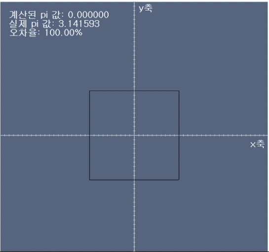

# 1주차- Monte carlo simulation

---

## 실습 전 준비사항
### Visual Studio 설치
1. https://visualstudio.microsoft.com/ko/downloads/
2. 커뮤니티 버전 다운로드
3. C++ 패키지 설치 
4. 실습자료 .sln 실행
5. x86 으로 변경 및 실행 

---
## 실습
Monte Carlo Simulation

### 실습 1: 히스토그램 그리기
- 주어진 파일 


- [0, 99] 범위에서 stdlib.h 의 ```rand()``` 를 사용하여 난수를 생성한다.
- 3,000,000 번 샘플링했을때의 histogram 을 그린다.
- 정답 예시 


### 실습 2: 주사위 던지기
- 주어진 파일 


- ```rand()``` 를 이용하여 MAX_TRY의 값만큼 주사위를 던지는 시행을 수행한다.
- 첫 번째 주사위와 두 번째 주사위의 눈의 합이 8인 경우를 Hit 으로 간주하고 Hit, Miss 횟수를 샌다.
- MAX_TRY 가 100, 1000, 10000 일때의 확률을 확인한다.**(제출 파일 3개)**
- 정답 예시 


### 실습 3: 원주율 구하기
- 주어진 파일 


- 주어진 사각형에 접하는 원을 이용하여 원주율을 구할 것
- ```MAX_POINTS == 10000``` 의 조건에서 구할 것
- ```rand()``` 함수 이용
- 정답 예시 


### 제출
- 파일 제출
    - visual studio 빌드 - 솔루션 정리
    - 폴더에서 debug, release, x86 파일 삭제
    - 실행되었을때의 GUI 스크린샷
    - 제출양식: {분반}\_{학번}\_{이름}.zip 
        - week1_practice1 (폴더)
        - week1_practice2 (폴더) 
        - week1_practice3 (폴더)
        - 20210907_p1_1.png (스크린샷)
        - 20210907_p2_1.png (스크린샷)
        - 20210907_p2_2.png (스크린샷)
        - 20210907_p2_3.png (스크린샷)
        - 20210907_p3_1.png (스크린샷)
    - 위의 파일들을 1_p_20210907_고소실.zip 으로 압축 후 제출 (분반/학번/이름)
    - [Submit](https://www.dropbox.com/request/csc0Osjzq0NPaatImukX)
---
## 과제
- 실습 3에서 했던 원주율 구하기의 오차율을 1% 미만으로 할 것
- ```rand()``` 함수 대신 c++ 의 내장 random 함수인 ```mt19937``` (메르센 트위스터 난수 생성기)를 이용할 것
- 과제 정답 예시 


### 제출
- 파일 제출
    - visual studio 빌드 - 솔루션 정리
    - 폴더에서 debug, release, x86 파일 삭제
    - 실행되었을때의 GUI 스크린샷 ({학번}.png)
    - 제출양식: {분반}\_{학번}\_{이름}.zip 
        - week1_practice (폴더)
        - 20210907_assign1.png (스크린샷)
        - 위의 두 파일을 1_a_20210907_고소실.zip 으로 압축 후 제출
    - [Submit](https://www.dropbox.com/request/csc0Osjzq0NPaatImukX)